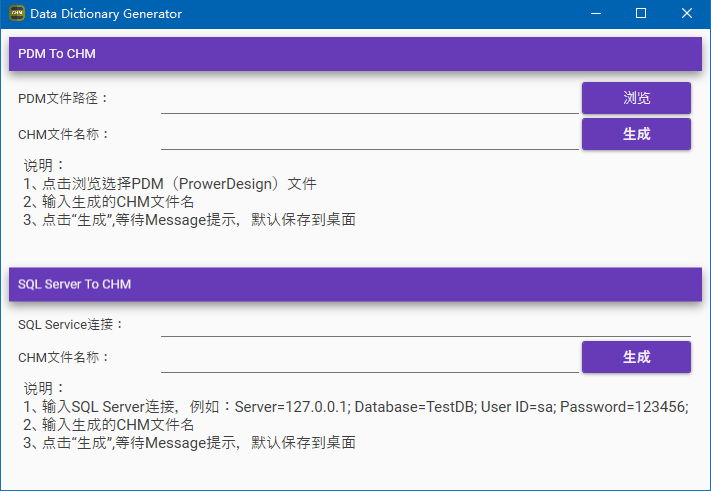

# Data Dictionary Generator
数据字典生成小工具，支持将PDM文件和从SQL Server数据库直接导出数据字典。

## 历史由来

由于本人最近使用*PowerDesigner*比较多，但*PowerDesigner*却不支持直接导出CHM，所以只好写个小工具转换一下，顺便实现从MSSQL导出CHM。

目前此工具支持：

- PDM To CHM
- MSSQL To CHM

## 截图

## 版本下载
https://github.com/ericktse/DataDictionaryGenerator/releases
